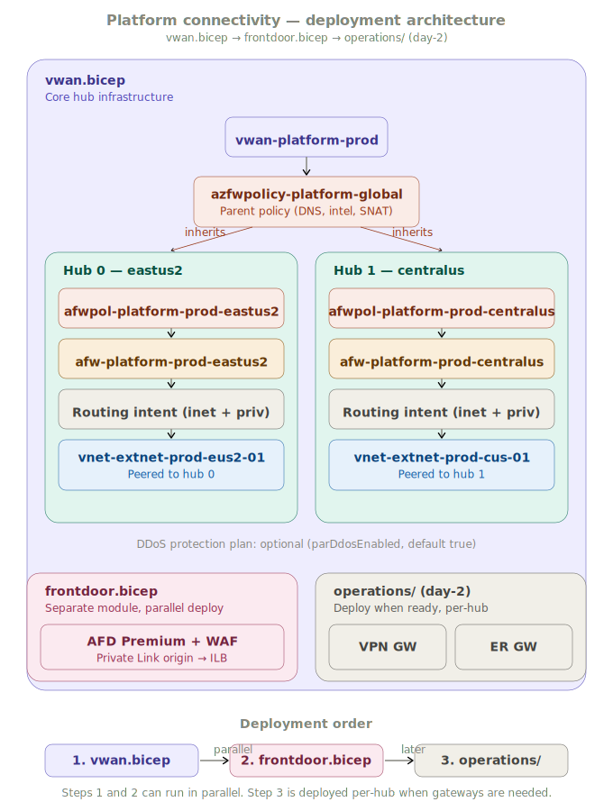
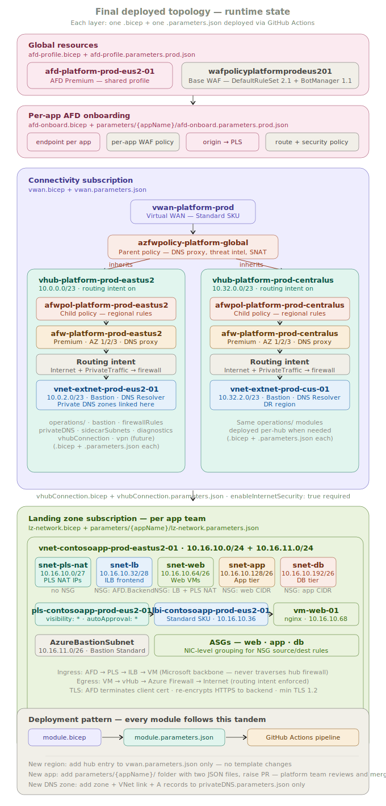

# Azure Platform Connectivity — Greenfield Case Study

> A production-grade Azure connectivity platform built from scratch for a state government agency. This repository contains the full Infrastructure-as-Code for a Virtual WAN hub-and-spoke network fabric, Azure Firewall Premium with parent/child policy hierarchy, Azure Front Door Premium as a shared ingress platform, and a suite of day-2 operations modules, all deployed via GitHub Actions CI/CD pipelines.

---

## Table of Contents

1. [Project Context](#1-project-context)
2. [The Problem: Starting from Zero](#2-the-problem-starting-from-zero)
3. [Architecture Overview](#3-architecture-overview)
4. [Design Decisions and Defense](#4-design-decisions-and-defense)
5. [Repository Structure](#5-repository-structure)
6. [Deployment Sequence](#6-deployment-sequence)
7. [Module Reference](#7-module-reference)
8. [CI/CD Pipeline Design](#8-cicd-pipeline-design)
9. [Firewall Policy Hierarchy](#9-firewall-policy-hierarchy)
10. [Ingress Architecture](#10-ingress-architecture)
11. [Private DNS Strategy](#11-private-dns-strategy)
12. [Day-2 Operations](#12-day-2-operations)
13. [Lessons Learned](#13-lessons-learned)
14. [Roadmap](#14-roadmap)

---

## 1. Project Context

This repository represents the connectivity subscription layer of a greenfield Azure tenant built for a state government agency with no prior cloud infrastructure. The engagement started with a blank Azure enrollment with no subscriptions, no governance structure, no naming conventions, no network design, no IaC tooling, no CI/CD pipelines, and no documented processes.

The platform team's mandate was to design and deliver a production-grade cloud network fabric that would:

- Support multiple application teams onboarding workloads concurrently
- Enforce Zero-Trust network segmentation at every layer
- Provide a secure, scalable public ingress path for web facing applications
- Force all egress traffic through centralized inspection
- Be fully codified in Infrastructure-as-Code with no manual portal deployments
- Support a DR strategy spanning two Azure regions

The MVP was demonstrated end-to-end in a sandbox environment with live ingress traffic flowing from a browser through Azure Front Door, through a Private Link Service, through an Internal Load Balancer, to a web VM before any production deployment began.

---

## 2. The Problem: Starting from Zero

### What did not exist

- No Azure subscriptions provisioned
- No Management Group hierarchy
- No Azure Policy assignments
- No network topology or CIDR design
- No naming conventions
- No IAM roles or service principals
- No IaC repositories or pipelines
- No operational runbooks or deployment processes
- No monitoring or diagnostics configuration
- No security baseline

### Constraints

- 100% Azure stack
- Bicep as the IaC language of choice
- GitHub Actions as the CI/CD platform
- Production deadline within months of engagement start
- Platform team responsible for connectivity only as application teams own their landing zones

### Approach

Rather than just starting with a commercial landing zone accelerator and working backwards, the decision was made to trim and opinionate the accelerator and build a purpose-fit module from the ground up using Azure Verified Modules (AVM) as primitives where appropriate. This gave the team full visibility into every resource deployed and avoided carrying unused code paths from generic accelerators into a regulated government environment.

The design followed three principles throughout:

**Separation of concerns** — connectivity infrastructure (vWAN, firewall, Front Door) is owned by the platform team and lives in this repo. Application landing zones are owned by app teams and live in separate repos. The platform team provides the network fabric; app teams consume it.

**Everything as code** — no manual portal deployments. Every resource is defined in Bicep, every deployment runs through GitHub Actions with what-if validation and branch protection. The portal is used for observation, not configuration.

**Parameterize, don't fork** — one Bicep template per concern, multiple parameter files per environment or region. Adding a new region, a new app, or a new firewall rule never requires touching template code.

---

## 3. Architecture Overview

Two diagrams are provided. `docs/architecture.svg` (rendered on the repo landing page) shows the **deployment architecture** — what each Bicep module creates, the parent/child firewall policy hierarchy, and the three-tier deployment order. The topology below shows the **final runtime state** — every resource, traffic paths, and the Bicep+parameter tandem pattern for each layer.

### Deployment architecture

<p align="center">
  
</p>

> Each box maps to a `.bicep` + `.parameters.json` tandem deployed via GitHub Actions. `vwan.bicep` and `afd-profile.bicep` deploy in parallel. All `operations/` modules are additive day-2 deployments that never touch core templates.

### Final deployed topology

<p align="center">
  
</p>

> The topology above shows every resource in its runtime state. Color coding: pink = AFD/global ingress, purple = connectivity subscription, teal = vWAN hubs, amber = firewalls, blue = sidecar VNets and ILB, green = landing zone. The legend at the bottom of the diagram shows the Bicep+parameter tandem deployment pattern that applies to every layer.

### Traffic paths (text reference)

```
┌─────────────────────────────────────────────────────────────────────────┐
│                        CONNECTIVITY SUBSCRIPTION                         │
│                                                                          │
│  ┌─────────────────────────────────────────────────────────────────┐    │
│  │                      VIRTUAL WAN (Standard)                      │    │
│  │                                                                  │    │
│  │   ┌───────────────────────┐   ┌───────────────────────┐         │    │
│  │   │   vHub East US 2      │   │   vHub Central US     │         │    │
│  │   │   10.0.0.0/23         │   │   10.32.0.0/23        │         │    │
│  │   │                       │   │                       │         │    │
│  │   │  Azure Firewall Prem  │   │  Azure Firewall Prem  │         │    │
│  │   │  AZ 1/2/3             │   │  AZ 1/2/3             │         │    │
│  │   │  Routing Intent ON    │   │  Routing Intent ON    │         │    │
│  │   │                       │   │                       │         │    │
│  │   │  Sidecar VNet         │   │  Sidecar VNet         │         │    │
│  │   │  10.0.2.0/23          │   │  10.32.2.0/23         │         │    │
│  │   │  (Bastion, DNS Res.)  │   │  (Bastion, DNS Res.)  │         │    │
│  │   └───────────┬───────────┘   └───────────────────────┘         │    │
│  │               │ vWAN Hub Connection                              │    │
│  └───────────────┼─────────────────────────────────────────────────┘    │
│                  │                                                        │
│  ┌───────────────┴─────────────────────┐                                │
│  │  Firewall Policy Hierarchy           │                                │
│  │  azfwpolicy-platform-global (parent) │                                │
│  │    └── afwpol-platform-prod-eus2     │                                │
│  │    └── afwpol-platform-prod-cus      │                                │
│  └──────────────────────────────────────┘                                │
│                                                                          │
│  ┌──────────────────────────────────────┐                               │
│  │  Azure Front Door Premium (global)   │                               │
│  │  Shared platform profile             │                               │
│  │  WAF: DefaultRuleSet 2.1 + BotMgr    │                               │
│  └──────────────────────────────────────┘                               │
└─────────────────────────────────────────────────────────────────────────┘

                         ▼  Hub Connection (per LZ)

┌─────────────────────────────────────────────────────────────────────────┐
│                     APPLICATION LANDING ZONE                            │
│                     (separate subscription)                             │
│                                                                         │
│   snet-pls-nat   snet-lb    snet-web    snet-app    snet-db             │
│   /27            /28        /26         /26         /26                 │
│                                                                         │
│   PLS ──────── ILB ──────── Web VMs                                    │
│    ▲                                                                    │
│    └── AFD Private Link Origin                                          │
└─────────────────────────────────────────────────────────────────────────┘
```

### Traffic paths

**Ingress (internet → application):**
```
Browser → AFD Premium endpoint
       → WAF inspection
       → Private Link Service (PLS) via Microsoft backbone
       → Internal Load Balancer frontend (no public IP)
       → Web VM
       
Note: This path does NOT traverse the vWAN hub firewall.
      AFD → PLS is entirely within the Microsoft backbone.
      The firewall only sees spoke-to-spoke and egress traffic.
```

**Egress (application → internet):**
```
Web VM → vWAN Hub → Azure Firewall (routing intent)
       → SNAT to firewall public IP
       → Internet

All RFC1918 spoke-to-spoke traffic also traverses the firewall.
```

**Management (Bastion → VM):**
```
Engineer → Bastion (sidecar VNet)
         → vWAN Hub → Azure Firewall
         → Landing Zone VNet → VM
         
Requires: NSG rule allowing Bastion subnet CIDR inbound on 22/3389
          Firewall rule allowing RFC1918 inbound
```

---

## 4. Design Decisions and Defense

### 4.1 Why Virtual WAN over hub-and-spoke with NVA

**Decision:** Azure Virtual WAN Standard with secured hubs over a traditional hub VNet with NVA or Azure Firewall injected.

**Defense:**

vWAN provides a fully managed routing fabric. With routing intent enabled, Microsoft handles BGP route propagation to all connected spokes automatically with no route tables to maintain, no UDR updates when new spokes are added, no risk of a missed UDR creating a routing black hole. At scale across dozens of landing zone VNets, manual UDR management becomes a reliability risk.

The alternative — hub VNet with Azure Firewall — requires manually maintaining route tables on every spoke subnet pointing `0.0.0.0/0` to the firewall private IP. Every new spoke means new route table entries. Every firewall migration or IP change means updating every spoke. vWAN eliminates this class of operational error entirely.

The tradeoff is cost. vWAN has a hub infrastructure charge on top of the firewall. For a government agency deploying to production with a multi-region DR requirement, the operational reliability benefit outweighed the cost.

### 4.2 Why Azure Firewall Premium over Standard

**Decision:** Azure Firewall Premium tier on both hubs.

**Defense:**

Premium tier unlocks IDPS (Intrusion Detection and Prevention System), TLS inspection, URL filtering, and web category filtering. For a government environment with compliance obligations, IDPS in Deny mode provides a layer of protection that Standard tier simply cannot provide. The Premium WAF on Front Door handles layer 7 inspection for HTTP/HTTPS ingress; the Premium firewall provides network-layer inspection for all other traffic including east-west and egress.

The parent/child policy hierarchy — a Premium-only feature — was the other deciding factor. Without it, rule changes would need to be applied to each regional firewall policy individually. With it, org-wide rules are defined once in the parent policy and propagate to all regions automatically.

### 4.3 Why routing intent over custom route tables

**Decision:** Routing intent enabled for both Internet and PrivateTraffic on both hubs.

**Defense:**

Routing intent is Microsoft's supported mechanism for ensuring all traffic — both internet-bound and spoke-to-spoke — traverses the hub firewall. Without routing intent, spokes can communicate directly without firewall inspection if UDRs are misconfigured. Routing intent makes the inspection requirement structural rather than procedural.

Critical implementation note: `enableInternetSecurity` must be set to `true` on every hub connection. Without this, the spoke VNet does not receive the `0.0.0.0/0` default route injection from the hub, and internet-bound traffic bypasses the firewall entirely despite routing intent being configured on the hub.

### 4.4 Why Azure Front Door Premium over Application Gateway

**Decision:** Azure Front Door Premium as the shared ingress platform over per-app Application Gateways.

**Defense:**

Application Gateway is a regional resource. For a multi-region deployment, each region would need its own Application Gateway per app, with Traffic Manager in front for failover. This multiplies cost, operational surface area, and failure domains.

Front Door Premium is a global anycast service that handles geographic distribution, failover, and WAF in a single resource. The Private Link origin feature (Premium-only) allows AFD to route traffic to an Internal Load Balancer with no public IP exposure on any backend resource, which is a hard security requirement.

The shared profile model of one AFD Premium profile with per-app endpoints means app teams get enterprise-scale global ingress without managing their own AFD infrastructure. Platform engineering maintains WAF policy centrally.

### 4.5 Why Private Link Service over public ILB

**Decision:** Internal Load Balancer fronted by a Private Link Service as the backend for AFD origins.

**Defense:**

The requirement was no public IP exposure on backend resources. Private Link Service allows AFD to connect to the ILB via Microsoft's backbone network, never traversing the public internet. The PLS acts as the connection broker. AFD creates a private endpoint in Microsoft-managed infrastructure that connects to the PLS, and the PLS routes to the ILB.

This also means the ingress traffic path (AFD → PLS → ILB → VM) is completely separate from the egress path (VM → vHub Firewall → Internet). Ingress never touches the hub firewall, preserving firewall throughput for egress and east-west inspection.

Key implementation note: PLS `visibility` and `autoApproval` must be set to `"*"` — not scoped to a specific subscription ID. AFD's private endpoints originate from Microsoft-managed subscriptions outside the customer's tenant, so scoping to a specific subscription ID will cause the connection to fail silently.

### 4.6 Why a monorepo with separate parameter files per app

**Decision:** Single connectivity repo with `parameters/{appName}/` folder structure for per-app configuration.

**Defense:**

Alternative approaches considered:
- One repo per app team: creates N repos to manage secrets, pipelines, and access for connectivity resources that the platform team owns. Operationally unworkable at scale.
- Hardcoded values per environment: creates template drift and makes environment parity impossible to verify.
- One parameter file per template: doesn't scale past one app team.

The `parameters/{appName}/` pattern keeps all platform infrastructure in one place, one secrets store, one pipeline to maintain. Onboarding a new app team requires only: creating a parameter folder, populating two JSON files, and raising a pull request. The platform team's PR review is the change control gate. Template code never changes for new onboarding.

### 4.7 Why the firewall policy hierarchy is parent/child rather than a single policy per region

**Decision:** One global parent policy + one child policy per region, all policies co-located in the primary region.

**Defense:**

Azure Firewall policy inheritance allows org-wide rules (DNS proxy config, threat intel mode, SNAT private ranges) to be defined once and propagate to all regional firewalls automatically. Without inheritance, the same rule set would need to be maintained separately per region creating drift risk and doubling the change surface for every rule update.

The constraint: parent and child policies must reside in the same Azure region. A policy can be *associated* with a firewall in any region, but the policy resource itself must be co-located with its parent. All policies are therefore created in `parLocation` (East US 2) and the Central US firewall references its child policy cross-region.

### 4.8 Why sidecar VNets instead of subnets inside the hub

**Decision:** Separate sidecar VNets peered to each hub for Bastion and DNS Private Resolver, rather than adding subnets inside the hub address space.

**Defense:**

Virtual Hub address space cannot host arbitrary subnets, rather, it is reserved for hub infrastructure (router, firewall, gateways). Bastion and DNS Private Resolver require actual subnet resources in a standard VNet. The sidecar VNet pattern places these management resources adjacent to the hub, peered via vWAN, so they participate in the hub routing fabric without consuming hub address space.

---

## 5. Repository Structure

```
ghr-prod-sub-connectivity-bicep/
│
├── .github/
│   ├── PULL_REQUEST_TEMPLATE.md
│   └── workflows/
│       ├── Create_MG.yml                         # Management Group creation
│       ├── MG_Level_Deployment.yml               # MG-scoped deployments
│       ├── ResourceGroup_Level_Deployment.yml    # RG-scoped deployments (main pipeline)
│       ├── Subscription_Level_Deployment.yml     # Sub-scoped deployments
│       └── Sub_Placement.yml                     # Subscription placement in MG hierarchy
│
├── docs/
│   └── architecture.svg                          # Architecture diagram
│
├── networking/
│   └── modules/
│       ├── vwanConnectivity/
│       │   ├── vwan.bicep                        # MVP: vWAN, hubs, firewalls, policy hierarchy
│       │   ├── vwan.parameters.json              # MVP parameter file
│       │   └── parameters/
│       │       └── vwanConnectivity.parameters.az.multiRegion.all.json
│       ├── vnetPeeringVwan/
│       │   └── vnetPeeringVwan.bicep             # Hub connection helper (subscription scope)
│       └── vpnGateway/
│           └── vpnGateway.bicep                  # VPN gateway (day-2, not yet deployed)
│
├── operations/
│   ├── bastion/
│   │   └── bastion.bicep                         # Bastion hosts in sidecar VNets
│   ├── diagnostics/
│   │   └── diagnostics.bicep                     # Firewall + Bastion diagnostic settings
│   ├── firewall/
│   │   ├── firewallPolicy/
│   │   │   └── firewallPolicy.bicep              # Firewall policy management
│   │   └── firewallRules/
│   │       └── firewallRules.bicep               # Rule collection group deployments
│   ├── frontdoor/
│   │   ├── afd-profile/
│   │   │   ├── afd-profile.bicep                 # Shared AFD profile + base WAF (deploys once)
│   │   │   └── afd-profile.parameters.prod.json
│   │   └── afd-onboard/
│   │       ├── afd-onboard.bicep                 # Per-app onboarding (endpoint, origin, route)
│   │       └── parameters/
│   │           └── {appName}/
│   │               └── afd-onboard.parameters.prod.json
│   ├── nsg/
│   │   └── nsg.bicep                             # Bastion NSG rules
│   ├── privateDNS/
│   │   └── privateDNS.bicep                      # Private DNS zones + VNet links + A records
│   ├── sidecarsubnets/
│   │   └── sidecarSubnets.bicep                  # Subnet additions to sidecar VNets
│   ├── vhubConnection/
│   │   └── vhubConnection.bicep                  # Landing zone VNet → vHub connections
│   └── vpn/
│       ├── vpnSite/
│       │   └── vpnSite.bicep                     # VPN site configuration
│       └── vpnConnection/
│           └── vpnConnection.bicep               # VPN connection to site
│
├── resourceGroup/
│   └── resourceGroup.bicep                       # Resource group provisioning
│
├── security/
│   └── logging/
│       └── logging.bicep                         # Log Analytics workspace
│
└── landingZones/
    └── lz-app-engine2.bicep                      # Reference landing zone template (demo only)
```

---

## 6. Deployment Sequence

Deployments are ordered by dependency. Steps within the same tier have no dependency on each other and can run in parallel.

```
Tier 0 ─── Management Group hierarchy       (Create_MG.yml)
            Resource Groups                  (Subscription_Level_Deployment.yml)

Tier 1 ─── vWAN + hubs + firewalls          (ResourceGroup_Level_Deployment.yml → vwanConnectivity)
            Log Analytics workspace          (ResourceGroup_Level_Deployment.yml → logging)

Tier 2 ─── Sidecar subnets                  (operations/sidecarsubnets)
            NSGs for Bastion                 (operations/nsg)

Tier 3 ─── Bastion hosts                    (operations/bastion)
            Firewall rules                   (operations/firewall/firewallRules)
            Diagnostics                      (operations/diagnostics)

Tier 4 ─── AFD profile + base WAF           (operations/frontdoor/afd-profile)

Per landing zone onboarding:
            vHub connection                  (operations/vhubConnection)
            AFD origin onboarding            (operations/frontdoor/afd-onboard)
            Private DNS zones                (operations/privateDNS)
```

### vWAN deployment time

The vWAN deployment (Tier 1) is the longest step, approximately 30–45 minutes due to hub provisioning and firewall deployment. All other tiers are 5–15 minutes. Plan deployments accordingly and do not interrupt the vWAN deployment once started.

---

## 7. Module Reference

### `networking/modules/vwanConnectivity/vwan.bicep`

The core platform module. Deploys the entire hub infrastructure from a single template invocation.

**What it creates:**

| Resource | Count | Notes |
|---|---|---|
| Virtual WAN | 1 | Standard SKU, branch-to-branch enabled |
| Virtual Hub | 1 per hub entry | Standard SKU |
| Parent firewall policy | 1 | Global, in `parLocation` |
| Child firewall policy | 1 per hub | Regional, inherits parent, also in `parLocation` |
| Azure Firewall | 1 per hub | Premium, zone-redundant |
| Routing intent | 1 per hub | Internet + PrivateTraffic |
| Sidecar VNet | 1 per hub | Via AVM public registry module |
| vWAN peering | 1 per hub | Sidecar VNet → hub |
| DDoS Protection Plan | 1 (optional) | Shared across all sidecar VNets |
| Resource locks | Optional | Controlled via `parGlobalResourceLock` |

**Key parameters:**

| Parameter | Purpose |
|---|---|
| `parHubs` | Array of hub configurations — drives all hub-level resource creation |
| `parParentFirewallPolicyName` | Name of the global parent policy |
| `parParentFirewallIntelMode` | Threat intel mode for parent (Alert/Deny/Off) |
| `parGlobalResourceLock` | Override lock kind for all resources |
| `parTelemetryOptOut` | Opt out of AVM deployment telemetry |

**Adding a new region:** Append an entry to `parHubs` in `vwan.parameters.json`. Existing hubs are untouched (Bicep incremental mode).

---

### `operations/frontdoor/afd-profile/afd-profile.bicep`

Platform-owned, deploys once. Creates the shared AFD Premium profile and base WAF policy.

**What it creates:**

| Resource | Notes |
|---|---|
| AFD Premium profile | Global resource, shared across all app endpoints |
| Base WAF policy | Microsoft_DefaultRuleSet 2.1 (Block) + BotManagerRuleSet 1.1 |
| Custom domain (conditional) | Only deployed when both `parCustomDomain` and `parCertificateSecretUri` are set |

**Custom domain and cert:** Parameters default to empty. Populate them when the org's domain and certificate are ready and redeploy — no structural change required.

---

### `operations/frontdoor/afd-onboard/afd-onboard.bicep`

Deploys once per application team onboarding. Creates all app-specific AFD resources within the shared platform profile.

**What it creates:**

| Resource | Notes |
|---|---|
| Per-app WAF policy | Inherits managed rules from base policy. App-specific custom rules added here. |
| AFD endpoint | One per app. Public hostname: `ep-{appname}-prod-eus2-01-{hash}.azurefd.net` |
| Origin group | Health probe (HTTPS HEAD), load balancing config |
| Origin | Points to app's PLS via `sharedPrivateLinkResource`. No public IP exposure. |
| Security policy | Associates per-app WAF to the endpoint |
| Route | HTTPS-only forwarding, optional custom domain, `/*` pattern match |

**Onboarding a new app team:**

1. App team deploys their landing zone (their repo), gets `outPLSId` and `outIlbFrontendIp` as outputs.
2. App team creates `operations/frontdoor/afd-onboard/parameters/{appName}/afd-onboard.parameters.prod.json` with their PLS ID and ILB IP.
3. App team raises a PR to this repo.
4. Platform team reviews (validate CIDR, PLS ID format, naming convention).
5. Merge triggers the AFD onboarding workflow automatically.

---

### `operations/firewall/firewallRules/firewallRules.bicep`

Day-2 module for managing firewall rule collection groups. Targets existing firewall policies by name and does not touch the policy resource itself, avoiding ARM PUT conflicts with the parent template.

**Pattern:** Pass an array of rule collection group objects. Each object specifies the `firewallPolicyName`, group `name`, `priority`, and `ruleCollections`. Multiple policies (East US 2 and Central US) can be updated in a single deployment.

**Important:** ARM locks rule collection groups during updates. If a previous deployment is still in `Updating` state, the next deployment will fail with `FirewallPolicyRuleCollectionGroupUpdateNotAllowedWhenUpdatingOrDeleting`. Always confirm the previous group shows `Succeeded` in the portal before redeploying.

---

### `operations/privateDNS/privateDNS.bicep`

Reusable module for private DNS zone management. One zone per Azure service type, multiple A records per zone.

**Pattern for App Service:**

```json
{
  "parPrivateDnsZoneName": "privatelink.azurewebsites.net",
  "parVnetLinks": [
    { "name": "link-vnet-extnet-prod-eus2-01", "vnetId": "/subscriptions/.../vnet-extnet-prod-eus2-01" }
  ],
  "parARecords": [
    { "name": "appname-<hash>.eastus2-01", "ip": "10.x.x.x" },
    { "name": "appname-<hash>.scm.eastus2-01", "ip": "10.x.x.x" }
  ]
}
```

**DNS resolution chain:**

```
VM in landing zone
  → DNS query to firewall private IP (DNS proxy enabled)
    → 168.63.129.16 (Azure DNS)
      → checks Private DNS Zones linked to sidecar VNet
        → returns A record IP (private endpoint IP)
```

The zone is linked to the **sidecar VNet**, not individual spoke VNets. Because the firewall DNS proxy is enabled and all spokes route through the hub, this single link covers all connected landing zones without per-spoke configuration.

---

### `operations/vhubConnection/vhubConnection.bicep`

Connects landing zone VNets to the vWAN hub. Run once per landing zone onboarding.

**Critical parameter:** `enableInternetSecurity` (or portal toggle "Enable Internet Security") must be `true` on every connection. Without it, the spoke receives a direct `0.0.0.0/0` route to Internet instead of through the firewall, bypassing routing intent entirely.

---

## 8. CI/CD Pipeline Design

All deployments run through GitHub Actions. No manual CLI deployments in production.

### Branch protection

All workflows include a branch check job that fails if the trigger branch is not `main`. This prevents accidental deployments from feature branches.

### Deployment pattern (every workflow)

```
branch_check → What-If (preview) → Template Validation → Deploy → Display Results
```

What-if runs first and outputs a resource-level diff. Template validation catches syntax and schema errors. Deployment only proceeds if both pass.

### Authentication

Deployments authenticate via `AZURE_CREDENTIALS` secret (service principal with client secret). **Production recommendation:** Migrate to Workload Identity Federation (OIDC) — service principal with client secret is not recommended for production as it requires secret rotation and is vulnerable to credential leakage.

### Workflow dispatch inputs

The `ResourceGroup_Level_Deployment.yml` workflow takes three inputs:

| Input | Purpose |
|---|---|
| `deploymentName` | Key that maps to a Bicep/parameter file path via switch statement |
| `resourceGroupName` | Target resource group |
| `subscriptionId` | Target subscription |

The switch statement pattern means adding a new deployment target requires only adding a `case` to the switch while the rest of the workflow is reused.

---

## 9. Firewall Policy Hierarchy

```
azfwpolicy-platform-global  (parent — East US 2, org-wide rules)
  │
  ├── afwpol-platform-prod-eastus2  (child — East US 2 hub)
  │     └── afw-platform-prod-eastus2  (firewall references this child policy)
  │
  └── afwpol-platform-prod-centralus  (child — Central US hub, physically in East US 2)
        └── afw-platform-prod-centralus  (firewall in Central US references cross-region)
```

### Rule inheritance

| Rule type | Where to define | Propagates to children? |
|---|---|---|
| DNS proxy / custom DNS | Parent | Yes |
| Threat intel mode | Parent | Yes (children can only be equal or stricter) |
| SNAT private ranges | Parent | Yes |
| Org-wide network rules | Parent | Yes |
| Org-wide application rules | Parent | Yes |
| Region-specific rules | Child | No |
| NAT rules | Child only | Never inherited |

### Same-region constraint

Parent and child policies must reside in the same Azure region. All policies in this deployment live in East US 2 (`parLocation`). The Central US firewall references its child policy cross-region. This is supported by Azure but the policy resource itself must remain in East US 2.

---

## 10. Ingress Architecture

### Traffic path (AFD → PLS → ILB → VM)

```
Internet client
  │
  ▼
Azure Front Door Premium (global anycast)
  │  WAF inspection (DefaultRuleSet 2.1, BotManager 1.1)
  │  TLS termination (customer cert, min TLS 1.2)
  │
  ▼ Microsoft backbone (no public internet traversal)
  │
Private Link Service (snet-pls-nat, /27)
  │  NAT IP sourced from snet-pls-nat
  │  visibility: "*", autoApproval: "*" (required for AFD)
  │
  ▼
Internal Load Balancer (snet-lb, /28)
  │  Frontend IP: static private IP
  │  Standard SKU
  │  No public IP
  │
  ▼
Web VM (snet-web, /26)
  │  NSG: allow AzureLoadBalancer + PLS NAT subnet inbound on 443
  │  nginx / app server
```

### Why this path does not traverse the hub firewall

The AFD → PLS connection is made via Microsoft's backbone network. The private endpoint created by AFD terminates inside Microsoft-managed infrastructure. It never enters the customer's network until it exits the PLS into `snet-pls-nat`. At that point it is already inside the landing zone VNet, moving from subnet to subnet, not traversing the hub.

The firewall only sees: (1) egress from VMs to the internet, and (2) spoke-to-spoke traffic between landing zones.

### Subnet segmentation design

Each landing zone uses five subnets with NSG enforcement at every boundary:

| Subnet | CIDR | Purpose | Key NSG rule |
|---|---|---|---|
| snet-pls-nat | /27 | PLS NAT IPs | `privateLinkServiceNetworkPolicies: Disabled` (required) |
| snet-lb | /28 | ILB frontend | Allow AzureFrontDoor.Backend + AzureLoadBalancer inbound |
| snet-web | /26 | Web tier VMs | Allow AzureLoadBalancer + PLS NAT CIDR inbound on 443 |
| snet-app | /26 | App tier | Allow snet-web CIDR inbound on app port |
| snet-db | /26 | Data tier | Allow snet-app CIDR inbound on DB port |

The separation of `snet-lb` and `snet-web` into distinct subnets, rather than placing the ILB frontend in the web subnet, enforces a hard network boundary between load balancing infrastructure and compute. This satisfies CIS/NIST segmentation requirements and contains blast radius if a web VM is compromised.

### TLS design

AFD terminates TLS from the client using the org's certificate (customer-managed, stored in Key Vault). AFD re-encrypts and forwards HTTPS to the ILB backend. End-to-end TLS means no cleartext segment in the traffic path.

**Important:** AFD health probes cannot validate self-signed certificates. Backends must use CA-signed certificates or the probe will fail and the origin will be marked unhealthy, resulting in 503 responses. Do not use self-signed certs on ILB backends in production.

---

## 11. Private DNS Strategy

### Design principle

Private DNS zones live in the connectivity subscription and are linked to sidecar VNets only. Because the Azure Firewall DNS proxy is enabled on both hubs, all DNS queries from all connected spoke VNets are proxied through the firewall to `168.63.129.16`, which resolves against zones linked to the sidecar VNet. This means:

- One VNet link per zone, not N links per zone (one per spoke)
- New landing zones automatically benefit from all existing private DNS zones with no additional configuration
- Private DNS management stays in the platform team's scope, not distributed across landing zones

### Zone naming

Azure private DNS zones for private endpoints follow the pattern `privatelink.{service}.{domain}`. One zone per Azure service type:

| Service | Zone |
|---|---|
| App Service | `privatelink.azurewebsites.net` |
| Key Vault | `privatelink.vaultcore.azure.net` |
| Storage (blob) | `privatelink.blob.core.windows.net` |
| Azure SQL | `privatelink.database.windows.net` |
| Container Registry | `privatelink.azurecr.io` |

### A record naming for App Service

App Service private endpoints with newer Azure infrastructure generate FQDNs with a hash and region suffix:

```
appname-<hash>.<region>-01.privatelink.azurewebsites.net      (main app)
appname-<hash>.scm.<region>-01.privatelink.azurewebsites.net  (Kudu/SCM)
```

Both records require the same private endpoint IP. Verify the exact FQDN format from the private endpoint DNS configuration tab in the portal before creating A records.

### DNS Private Resolver

The `DNSPrivateResolverInbound` and `DNSPrivateResolverOutbound` subnets are provisioned in sidecar VNets but the resolver is not yet deployed. It will be needed when:

- **ExpressRoute arrives:** on-premises machines need to resolve Azure private endpoint names → inbound resolver provides a static IP for on-premises DNS forwarding rules
- **Hybrid DNS:** Azure VMs need to resolve on-premises hostnames → outbound resolver with forwarding rules to on-premises DNS servers

---

## 12. Day-2 Operations

### Adding a firewall rule

1. Edit `operations/firewall/firewallRules/firewallRules.parameters.json`
2. Add a new rule collection or rule to the appropriate policy entry
3. Raise a PR, get approval, merge to `main`
4. The pipeline deploys `firewallRules.bicep` targeting the affected policy

**Never modify the firewall policy resource directly from this repo.** The policy (`firewallPolicy.bicep`) is owned by `vwan.bicep`. Day-2 rule management always goes through `firewallRules.bicep` which deploys rule collection groups only.

### Connecting a new landing zone

1. App team deploys their landing zone (their repo/pipeline)
2. Platform team runs `operations/vhubConnection/vhubConnection.bicep` with the new VNet details
3. **Critical:** Verify `enableInternetSecurity` is `true` on the connection
4. Platform team deploys `operations/frontdoor/afd-onboard/afd-onboard.bicep` with the app's PLS ID

### Adding a private DNS zone for a new service

1. Create a new parameter file or update the existing one in `operations/privateDNS/`
2. Set `parPrivateDnsZoneName` to the appropriate `privatelink.*` zone
3. Add A records for each private endpoint — verify exact record names from the PE DNS config tab
4. Deploy via pipeline

### Adding a new region

Add an entry to `parHubs` in `vwan.parameters.json`:

```json
{
  "addressPrefix": "10.64.0.0/23",
  "location": "westus2",
  "routingPreference": "ExpressRoute",
  "routerAutoScaleMin": 2,
  "routingIntentDestinations": ["Internet", "PrivateTraffic"],
  "firewallTier": "Premium",
  "firewallAvailabilityZones": ["1", "2", "3"],
  "firewallIntelMode": "Alert",
  "firewallDnsProxyEnabled": true,
  "firewallDnsServers": [],
  "sidecarVirtualNetwork": {
    "enabled": true,
    "name": "vnet-extnet-prod-wus2-01",
    "addressPrefixes": ["10.64.2.0/23"]
  }
}
```

Merge to `main`. Bicep incremental mode leaves existing hubs untouched. A new hub, firewall, child policy inheriting from the global parent, routing intent, and sidecar VNet are created automatically.

---

## 13. Lessons Learned

The following issues were encountered during the sandbox MVP deployment and resolved before production. They are documented here to prevent recurrence.

| Issue | Root cause | Resolution |
|---|---|---|
| PLS not visible to AFD private endpoint | `autoApproval` and `visibility` scoped to a specific subscription ID. AFD PE originates from Microsoft-managed subscriptions outside the tenant. | Set both to `"*"` |
| WAF policy managed rules validation failure | `Microsoft_DefaultRuleSet 2.1` requires `ruleSetAction: "Block"` explicitly. Empty arrays for `ruleGroupOverrides` and `exclusions` must be present. | Add `ruleSetAction: "Block"` and explicit empty arrays |
| AFD health probe failure (503 Service Unavailable) | Backend nginx configured with self-signed certificate. AFD health probes cannot validate self-signed certs — origin marked unhealthy. | Use CA-signed certificate or implement SSL offload at ILB. AFD terminates HTTPS; forward HTTP to backend. |
| vWAN routing intent not steering traffic through firewall | `enableInternetSecurity` not set on hub connection. Spoke received direct `0.0.0.0/0 → Internet` route. | Set `enableInternetSecurity: true` on hub connection via portal or Bicep |
| Firewall rule group locked during update | ARM PUT lock on rule collection group while previous operation still in `Updating` state | Wait for group to reach `Succeeded` state before retrying |
| WSL Zone.Identifier files | Files copied from Windows filesystem to WSL have NTFS alternate data streams attached as `:Zone.Identifier` files | `find . -name "*:Zone.Identifier" -type f -delete`. Clone directly within WSL terminal. |
| CLI output case sensitivity | `az deployment group show --query` is case-sensitive. `outPLSId` ≠ `outPlsId` | Always verify exact output key names: `az deployment group show --query "properties.outputs"` |
| ILB hairpin timeout | VM in ILB backend pool cannot reach the ILB frontend IP from within itself. Standard ILB does not support hairpin. | Expected behavior — test ILB forwarding from external source, not from within backend VM |

---

## 14. Roadmap

### Near-term (production hardening)

- [ ] Migrate GitHub Actions authentication from service principal client secret to Workload Identity Federation (OIDC)
- [ ] Enable resource locks (`CanNotDelete`) on all production connectivity resources
- [ ] Deploy `diagnostics.bicep` to ship firewall and Bastion logs to Log Analytics
- [ ] Replace demo firewall rules (RFC1918 catch-all) with scoped production rules per workload tier
- [ ] Implement custom domain and customer-managed certificate on AFD profile

### Medium-term

- [ ] Deploy DNS Private Resolver (inbound endpoint) in sidecar VNets ahead of ExpressRoute circuit delivery
- [ ] Deploy ExpressRoute gateways per hub when circuits are ready (`operations/vpn/`)
- [ ] Integrate AVNM (Azure Virtual Network Manager) for IPAM — CIDR values in parameter files map directly to AVNM pool references, no structural template change needed
- [ ] Add GitHub Actions path-filtered triggers so vWAN changes only run the vWAN job and Front Door changes only run the Front Door job
- [ ] Add workflow input validation — fail fast if `{appName}` parameter folder does not exist before attempting deployment

### Long-term

- [ ] Subscription vending pipeline — automate landing zone provisioning, hub connection, and AFD onboarding as a single self-service workflow triggered by app team request
- [ ] Azure Policy assignments for network governance (NSG required on every subnet, no public IPs on VMs, etc.)
- [ ] FinOps tagging enforcement via Azure Policy with deny effect — build on existing tag-driven budget tracking
- [ ] Traffic Manager for non-HTTP workloads (FTP, custom protocols) — shell config exists in `operations/trafficManager/`, completion pending workload details

---

## Prerequisites

- Azure subscription with Contributor role for the service principal in `AZURE_CREDENTIALS`
- GitHub repository secret: `AZURE_CREDENTIALS` (service principal JSON)
- AVM public registry accessible from deployment environment (`br/public:avm/res/network/virtual-network:0.7.0`)

## Contributing

All changes must be made on a feature branch and merged via pull request. The PR template (`PULL_REQUEST_TEMPLATE.md`) includes required fields for change description, what-if output, and testing confirmation. Direct pushes to `main` are blocked by branch protection rules.

For firewall rule changes: edit `firewallRules.parameters.json`, raise a PR with the what-if diff attached, and request platform team review.

For new app onboarding: create `operations/frontdoor/afd-onboard/parameters/{appName}/afd-onboard.parameters.prod.json`, raise a PR, and platform team will validate before merging.
